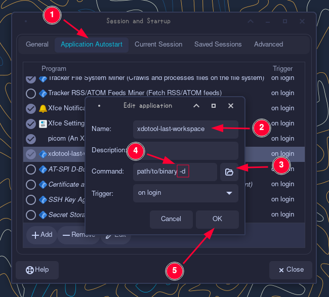
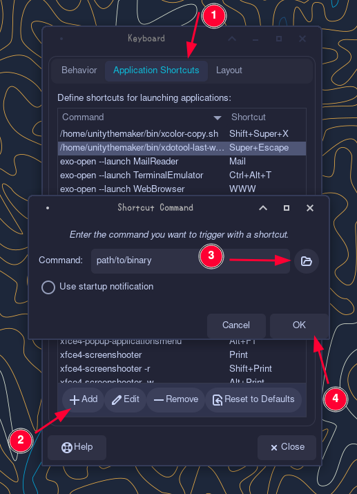

# xdotool-last-workspace

Xfce does not provide a feature for going to the last active workspace.
Bad idea but I made a daemon to run in the background and save the
last active workspace to a file in cache folder (`xdotool get_desktop`
to get the current active workspace) and when user runs the
command without the `-d` flag, it uses `xdotool set_desktop` to go to
the last active workspace.

## Build

You need to install [Go](https://go.dev/doc/install). My golang
version was `go1.19.4` when I developed this.

```bash
git clone https://github.com/unitythemaker/xdotool-last-workspace && \
cd xdotool-lastl-workspace && \
go build main.go
```

After using the following command the binary will be available as main.

## Usage

### Basic Usage

```bash
xdotool-last-workspace -d # starts daemon
xdotool-last-workspace # goes to the last active workspace
```

### Detailed Usage

After you have the binary, place it somewhere. It can be `/usr/bin/`
or anywhere you want it to be.

Now you need to somehow start this binary at login with `-d` flag to
save the last active workspace.

For example; if you are an Xfce user, open "Session and Startup" app
(or run `xfce4-session-settings`). Then go to `Application Autostart`
tab. Now use the `Add` button on the left bottom corner. Give it a name
for example `xdotool-last-workspace`. For the command, use the select
file button on the right and select the binary you placed it somewhere.
After you selected the binary file, do not forget to add `-d` flag to
end of the filename. `Trigger` should stay the same `on login`. Now
click OK to save and then close it.



After you set-up the daemon, now you can add a keybind to easily move
to last workspace you were on.

To do this on Xfce, open "Keyboard" app (or run `xfce4-keyboard-settings`).
Then go to `Application Shortcuts` tab. Now use the `Add` button on the
left bottom corner. For the command, use the select file button on the
right and select the binary you placed it somewhere but this time DO NOT
add the `-d` flag. Then hit OK. It will ask you for a keybind you want
to use. Use the key combo you want to use.



Now you are ready! It will start working on the next login. You can
re-login or you can run `path/to/binary -d & disown`.
